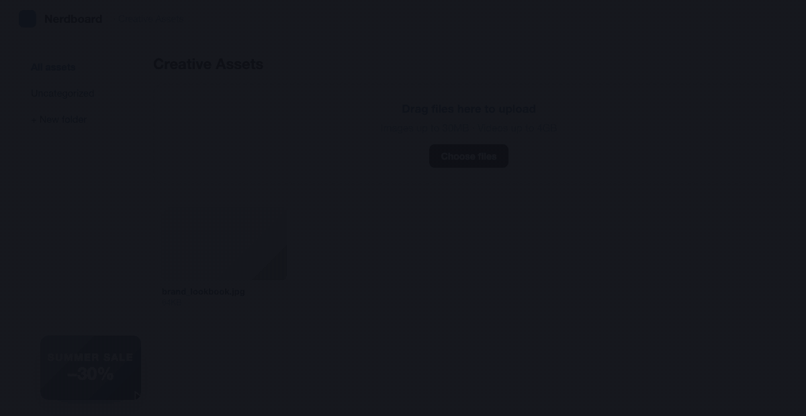
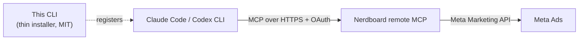

<div align="center">

# Nerdboard Meta Ads MCP

**Launch and manage Meta ads from Claude Code and Codex CLI — just by asking.**

[](https://www.npmjs.com/package/@nerdlab-dev/meta-ads-mcp)
[](https://www.npmjs.com/package/@nerdlab-dev/meta-ads-mcp)
[](https://github.com/nerdlab-dev/meta-ads-mcp/actions/workflows/ci.yml)
[](https://nodejs.org)
[](./LICENSE)



</div>

Setting up a Meta campaign means clicking through Ads Manager screens for every campaign, ad set, and ad. With Nerdboard's hosted remote MCP, your AI coding agent does it for you — **no Meta developer token, no self-hosting, no API keys on your machine**.

This repository is the thin MIT-licensed installer. All ad features run on Nerdboard's managed server.

## What you can do

- **Launch campaigns** — "Launch a Meta ad with my new creative, ₩30,000/day, retargeting." One ask creates the campaign, ad set, and ad.
- **Analyze performance** — spend, ROAS, purchases, demographics, and placement breakdowns through natural conversation.
- **Manage creatives** — upload images and videos, then reuse them across ads.
- **Find your audience** — search interests, behaviors, and geo targeting without leaving the terminal.
- **Stay in control** — pause, resume, and tune budgets with plain-language requests.

## Quick start

Requires **Node.js 20+** and **Claude Code** or **Codex CLI**. Setup takes about 2 minutes.

```bash
npx -y @nerdlab-dev/meta-ads-mcp@latest install
```

If both clients are installed, pick one:

```bash
npx -y @nerdlab-dev/meta-ads-mcp@latest install --client claude
npx -y @nerdlab-dev/meta-ads-mcp@latest install --client codex
```

Then sign in:

- **Claude Code** — run `/mcp` and complete the login in your browser.
- **Codex CLI** — run:

  ```bash
  codex mcp login \
    --scopes ad-channel:meta:read,ad-channel:meta:campaign:read,ad-channel:meta:creative:read,ad-channel:meta:campaign:write,ad-channel:meta:creative:write \
    nerdboard-meta-ads
  ```

During login you choose your Nerdboard workspace and permissions. If you still need a subscription or a connected Meta ad account, Nerdboard walks you through it on screen.

That's it — ask your agent for an ad.

## How it works



The installer registers `nerdboard-meta-ads` in your MCP client using each product's official `mcp add` command. Every ad operation runs on Nerdboard's managed server, which talks to the Meta Marketing API on your behalf. Using it requires a Nerdboard account, an active subscription, and a connected Meta ad account.

## Security & transparency

What the installer does:

- Detects whether Codex CLI and Claude Code are installed.
- Checks whether a `nerdboard-meta-ads` connection already exists.
- Registers the connection with the product's official `mcp add` command.
- Leaves everything untouched when the same connection already exists.
- Refuses to overwrite when the same name points to a different URL.

What the installer never does:

- Read or store Meta access tokens.
- Proxy or process ad requests locally.
- Include Nerdboard server code or ad-creation logic.
- Delete or overwrite your existing MCP configuration.

Every push and pull request runs an automated public-content check covering file allowlists, credential patterns, and prohibited terms.

## Manual install

Claude Code:

```bash
claude mcp add --transport http --scope user nerdboard-meta-ads https://nerdboard.kr/mcp
```

Codex CLI:

```bash
codex mcp add nerdboard-meta-ads --url https://nerdboard.kr/mcp
```

Any other remote-MCP-capable client (Cursor, etc.) can register the URL directly:

```text
https://nerdboard.kr/mcp
```

## Development

```bash
npm test
npm run check
npm run check:public
npm pack --dry-run
```

## License

The CLI source in this repository is [MIT licensed](./LICENSE). The Nerdboard service and its remote MCP server are governed by separate terms of service.

---

<p align="center">Made by <a href="https://nerdboard.kr">Nerdboard</a></p>
