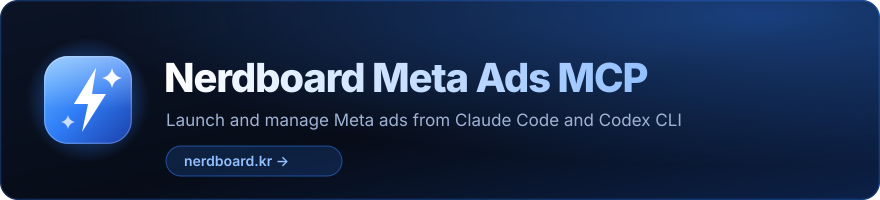
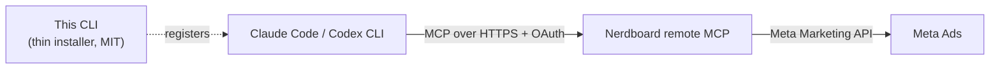

<div align="center">

[](https://nerdboard.kr)

**Launch and manage Meta ads from Claude Code and Codex CLI — just by asking.**

[](https://www.npmjs.com/package/@nerdlab-dev/meta-ads-mcp)
[](https://www.npmjs.com/package/@nerdlab-dev/meta-ads-mcp)
[](https://github.com/nerdlab-dev/meta-ads-mcp/actions/workflows/ci.yml)
[](https://nodejs.org)
[](./LICENSE)

[](https://claude.com/claude-code)
[![Works with OpenAI](https://img.shields.io/badge/Works_with-OpenAI-000000?style=flat-square&logo=data:image/svg%2Bxml;base64,PHN2ZyB3aWR0aD0iNzE2IiBoZWlnaHQ9IjcxNiIgdmlld0JveD0iMCAwIDcxNiA3MTYiIGZpbGw9Im5vbmUiIHhtbG5zPSJodHRwOi8vd3d3LnczLm9yZy8yMDAwL3N2ZyI+PHBhdGggZD0iTTUwOC43NDkgMzE3LjM5OUM1MTYuNzc3IDI4Ny4zMTQgNTA4Ljk5MSAyNTMuODg0IDQ4NS4zODkgMjMwLjI4MkM0NjEuNzg4IDIwNi42ODEgNDI4LjM2IDE5OC44OTUgMzk4LjI3MyAyMDYuOTIzQzM3Ni4yMzEgMTg0LjkyOCAzNDMuMzkgMTc0Ljk1NiAzMTEuMTQ4IDE4My41OTZDMjc4LjkwNiAxOTIuMjM0IDI1NS40NSAyMTcuMjkyIDI0Ny4zNiAyNDcuMzYxQzIxNy4yOTEgMjU1LjQ1MSAxOTIuMjMzIDI3OC45MSAxODMuNTk1IDMxMS4xNDlDMTc0Ljk1NyAzNDMuMzkxIDE4NC45MjcgMzc2LjIzMiAyMDYuOTI0IDM5OC4yNzRDMTk4Ljg5NiA0MjguMzU5IDIwNi42ODMgNDYxLjc4OSAyMzAuMjg0IDQ4NS4zOTFDMjUzLjg4NSA1MDguOTkyIDI4Ny4zMTMgNTE2Ljc3OSAzMTcuNDAxIDUwOC43NUMzMzkuNDQyIDUzMC43NDUgMzcyLjI4NiA1NDAuNzE3IDQwNC41MjUgNTMyLjA3OUM0MzYuNzY3IDUyMy40NDEgNDYwLjIyMyA0OTguMzg0IDQ2OC4zMTMgNDY4LjMxNUM0OTguMzgzIDQ2MC4yMjQgNTIzLjQ0IDQzNi43NjYgNTMyLjA3OCA0MDQuNTI2QzU0MC43MTYgMzcyLjI4NSA1MzAuNzQ3IDMzOS40NDMgNTA4Ljc0OSAzMTcuNDAyVjMxNy4zOTlaTTQ3MC44OTkgMjQ0Ljc3NkM0ODYuODkyIDI2MC43NyA0OTMuNDg4IDI4Mi42MDEgNDkwLjY4NyAzMDMuNDEyTDQxNS41NzcgMjYwLjA0NkM0MTIuNDExIDI1OC4yMTggNDA4LjUwOSAyNTguMjE4IDQwNS4zNDUgMjYwLjA0NkwzMTcuNDAxIDMxMC44MlYyNzcuNTI2QzMxNy40MDEgMjc1LjE5MSAzMTguNjUyIDI3My4wMDUgMzIwLjY3NiAyNzEuODM3TDM4Ny42NDQgMjMzLjE3NEM0MTQuMTc4IDIxOC4zNTMgNDQ4LjM0NiAyMjIuMjIzIDQ3MC45MDEgMjQ0Ljc3Nkg0NzAuODk5Wk0zNTcuODM3IDMxMS4xNDRMMzk4LjI3NSAzMzQuNDkxVjM4MS4xODVMMzU3LjgzNyA0MDQuNTMyTDMxNy4zOTggMzgxLjE4NVYzMzQuNDkxTDM1Ny44MzcgMzExLjE0NFpNMjY0Ljc3NiAyNjkuNjkzQzI2NS4yMDcgMjM5LjMwNSAyODUuNjQ0IDIxMS42NDkgMzE2LjQ1MyAyMDMuMzkzQzMzOC4zIDE5Ny41NCAzNjAuNTA1IDIwMi43NDQgMzc3LjEyNyAyMTUuNTczTDMwMi4wMTQgMjU4LjkzN0MyOTguODQ4IDI2MC43NjQgMjk2Ljg5OCAyNjQuMTQ0IDI5Ni44OTggMjY3Ljc5OFYzNjkuMzQ2TDI2OC4wNjUgMzUyLjY5OUMyNjYuMDQzIDM1MS41MzEgMjY0Ljc3NiAzNDkuMzUzIDI2NC43NzYgMzQ3LjAxN1YyNjkuNjkxVjI2OS42OTNaTTIwMy4zOTEgMzE2LjQ1NEMyMDkuMjQ0IDI5NC42MDggMjI0Ljg1NCAyNzcuOTc4IDI0NC4yNzYgMjY5Ljk5OVYzNTYuNzNDMjQ0LjI3NiAzNjAuMzg0IDI0Ni4yMjYgMzYzLjc2MyAyNDkuMzkyIDM2NS41OTFMMzM3LjMzNyA0MTYuMzY1TDMwOC41MDMgNDMzLjAxM0MzMDYuNDgxIDQzNC4xODEgMzAzLjk2MSA0MzQuMTg4IDMwMS45MzkgNDMzLjAyTDIzNC45NzEgMzk0LjM1N0MyMDguODY4IDM3OC43ODkgMTk1LjEzOCAzNDcuMjYxIDIwMy4zOTEgMzE2LjQ1NFpNMjQ0Ljc3NSA0NzAuOUMyMjguNzgxIDQ1NC45MDYgMjIyLjE4NiA0MzMuMDc1IDIyNC45ODYgNDEyLjI2NEwzMDAuMDk2IDQ1NS42M0MzMDMuMjYzIDQ1Ny40NTcgMzA3LjE2NCA0NTcuNDU3IDMxMC4zMjggNDU1LjYzTDM5OC4yNzMgNDA0Ljg1NlY0MzguMTQ5QzM5OC4yNzMgNDQwLjQ4NSAzOTcuMDIyIDQ0Mi42NzEgMzk0Ljk5NyA0NDMuODM5TDMyOC4wMjkgNDgyLjUwMkMzMDEuNDk1IDQ5Ny4zMjIgMjY3LjMyNyA0OTMuNDUyIDI0NC43NzIgNDcwLjlIMjQ0Ljc3NVpNNDUwLjg5NyA0NDUuOTgyQzQ1MC40NjYgNDc2LjM3MSA0MzAuMDI5IDUwNC4wMjcgMzk5LjIyIDUxMi4yODNDMzc3LjM3MyA1MTguMTM2IDM1NS4xNjggNTEyLjkzMiAzMzguNTQ3IDUwMC4xMDJMNDEzLjY1OSA0NTYuNzM4QzQxNi44MjYgNDU0LjkxMSA0MTguNzc1IDQ1MS41MzIgNDE4Ljc3NSA0NDcuODc3VjM0Ni4zMjlMNDQ3LjYwOSAzNjIuOTc3QzQ0OS42MzEgMzY0LjE0NSA0NTAuODk3IDM2Ni4zMjMgNDUwLjg5NyAzNjguNjU5VjQ0NS45ODVWNDQ1Ljk4MlpNNTEyLjI4MiAzOTkuMjIxQzUwNi40MjkgNDIxLjA2OCA0OTAuODE5IDQzNy42OTcgNDcxLjM5NyA0NDUuNjc2VjM1OC45NDZDNDcxLjM5NyAzNTUuMjkyIDQ2OS40NDggMzUxLjkxMiA0NjYuMjgxIDM1MC4wODVMMzc4LjMzNiAyOTkuMzExTDQwNy4xNyAyODIuNjYzQzQwOS4xOTIgMjgxLjQ5NSA0MTEuNzEyIDI4MS40ODcgNDEzLjczNCAyODIuNjU1TDQ4MC43MDIgMzIxLjMxOEM1MDYuODA1IDMzNi44ODcgNTIwLjUzNiAzNjguNDE1IDUxMi4yODIgMzk5LjIyMVoiIGZpbGw9IndoaXRlIi8+PC9zdmc+)](https://developers.openai.com/codex/cli/)
[](https://modelcontextprotocol.io)


</div>

Setting up a Meta campaign means clicking through Ads Manager screens for every campaign, ad set, and ad. With Nerdboard's hosted remote MCP, your AI coding agent does it for you — **no Meta developer token, no self-hosting, no API keys on your machine**.

This repository is the thin MIT-licensed installer. All ad features run on Nerdboard's managed server.

## What you can do

- **Launch campaigns** — "Launch a Meta ad with my new creative, ₩30,000/day, retargeting." One ask creates the campaign, ad set, and ad.
- **Analyze performance** — spend, ROAS, purchases, demographics, and placement breakdowns through natural conversation.
- **Manage creatives** — upload images and videos, then reuse them across ads.
- **Find your audience** — search interests, behaviors, and geo targeting without leaving the terminal.
- **Stay in control** — pause, resume, and tune budgets with plain-language requests.

## Quick start

Requires **Node.js 20+** and **Claude Code** or **Codex CLI**. Setup takes about 2 minutes.

```bash
npx -y @nerdlab-dev/meta-ads-mcp@latest install
```

If both clients are installed, pick one:

```bash
npx -y @nerdlab-dev/meta-ads-mcp@latest install --client claude
npx -y @nerdlab-dev/meta-ads-mcp@latest install --client codex
```

Then sign in:

- **Claude Code** — run `/mcp` and complete the login in your browser.
- **Codex CLI** — run:

  ```bash
  codex mcp login \
    --scopes ad-channel:meta:read,ad-channel:meta:campaign:read,ad-channel:meta:creative:read,ad-channel:meta:campaign:write,ad-channel:meta:creative:write \
    nerdboard-meta-ads
  ```

During login you choose your Nerdboard workspace and permissions. If you still need a subscription or a connected Meta ad account, Nerdboard walks you through it on screen.

That's it — ask your agent for an ad.

## How it works



The installer registers `nerdboard-meta-ads` in your MCP client using each product's official `mcp add` command. Every ad operation runs on Nerdboard's managed server, which talks to the Meta Marketing API on your behalf. Using it requires a Nerdboard account, an active subscription, and a connected Meta ad account.

## Security & transparency

What the installer does:

- Detects whether Codex CLI and Claude Code are installed.
- Checks whether a `nerdboard-meta-ads` connection already exists.
- Registers the connection with the product's official `mcp add` command.
- Leaves everything untouched when the same connection already exists.
- Refuses to overwrite when the same name points to a different URL.

What the installer never does:

- Read or store Meta access tokens.
- Proxy or process ad requests locally.
- Include Nerdboard server code or ad-creation logic.
- Delete or overwrite your existing MCP configuration.

Every push and pull request runs an automated public-content check covering file allowlists, credential patterns, and prohibited terms.

## Manual install

Claude Code:

```bash
claude mcp add --transport http --scope user nerdboard-meta-ads https://nerdboard.kr/mcp
```

Codex CLI:

```bash
codex mcp add nerdboard-meta-ads --url https://nerdboard.kr/mcp
```

Any other remote-MCP-capable client (Cursor, etc.) can register the URL directly:

```text
https://nerdboard.kr/mcp
```

## Development

```bash
npm test
npm run check
npm run check:public
npm pack --dry-run
```

## License

The CLI source in this repository is [MIT licensed](./LICENSE). The Nerdboard service and its remote MCP server are governed by separate terms of service.

## Trademarks

OpenAI and Codex are trademarks of OpenAI. Claude and Claude Code are trademarks of Anthropic, PBC. Meta is a trademark of Meta Platforms, Inc. All marks are used here only to describe compatibility. This project is independent and is not affiliated with, endorsed by, or sponsored by any of them.

---

<p align="center">Made by <a href="https://nerdboard.kr">Nerdboard</a></p>
