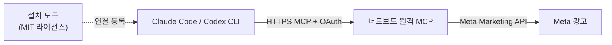

<div align="center">

**한국어** | [English](./README.en.md)

[](https://nerdboard.kr)

**광고 성과 조회부터 캠페인 운영까지, AI와 대화하며 처리하세요.**

[](https://www.npmjs.com/package/@nerdlab-dev/meta-ads-mcp)
[](https://www.npmjs.com/package/@nerdlab-dev/meta-ads-mcp)
[](https://github.com/nerdlab-dev/meta-ads-mcp/actions/workflows/ci.yml)
[](https://nodejs.org)
[](./LICENSE)

[](https://claude.com/claude-code)
[](https://developers.openai.com/codex/cli/)
[](https://modelcontextprotocol.io)


</div>

Meta 광고를 하나 집행하려면 광고 관리자에서 캠페인, 광고 세트, 광고를 차례로 만들어야 해요. 너드보드 원격 MCP를 연결하면 이 과정을 Claude Code나 Codex CLI에서 대화로 처리할 수 있어요. **Meta 개발자 토큰을 발급받거나 서버를 직접 띄울 필요도, API 키를 PC에 저장할 필요도 없어요.**

이 저장소에는 너드보드 원격 MCP를 연결하는 가벼운 설치 도구만 공개되어 있어요. 실제 광고 작업은 너드보드 서버에서 처리해요.

## 무엇을 할 수 있나요?

- **캠페인을 바로 시작해요** - “새 소재로 일 예산 3만 원짜리 Meta 리타게팅 광고를 만들어 줘.”라고 요청하면 캠페인부터 광고까지 한 번에 만들어요.
- **성과를 한눈에 살펴봐요** - 광고비, ROAS, 구매 수는 물론 인구 통계와 노출 위치별 성과도 대화로 확인해요.
- **소재를 올리고 다시 써요** - 이미지와 동영상을 업로드한 뒤 여러 광고에 활용해요.
- **알맞은 타겟을 찾아요** - 관심사, 행동, 지역 조건을 터미널에서 바로 검색해요.
- **운영 중인 광고를 조정해요** - 광고를 잠시 멈추거나 다시 시작하고, 예산도 대화로 바꿔요.

## 빠른 시작

준비물은 **Node.js 20 이상**과 **Claude Code** 또는 **Codex CLI**예요. 설치는 보통 2분이면 끝나요.

너드보드가 처음이라면 [너드보드 MCP 설치 가이드(PDF)](./docs/nerdboard-mcp-setup-guide.pdf)를 먼저 읽어 보세요. 회원가입부터 광고 채널 연결, 데이터 수집, MCP 승인까지 화면을 보며 따라갈 수 있어요.

```bash
npx -y @nerdlab-dev/meta-ads-mcp@latest install
```

Claude Code와 Codex CLI가 모두 설치되어 있다면 연결할 제품을 하나 골라 주세요.

```bash
npx -y @nerdlab-dev/meta-ads-mcp@latest install --client claude
npx -y @nerdlab-dev/meta-ads-mcp@latest install --client codex
```

연결이 끝나면 로그인해요.

- **Claude Code** - `/mcp`를 실행한 뒤 브라우저에서 로그인해요.
- **Codex CLI** - 아래 명령을 실행해요.

  ```bash
  codex mcp login nerdboard-meta-ads
  ```

로그인할 때 사용할 너드보드 작업공간을 고르고, AI가 사용할 전체 권한을 한 번에 승인해요. 아직 구독을 시작하지 않았거나 Meta 광고 계정을 연결하지 않았다면 화면 안내에 따라 먼저 준비해 주세요.

여기까지 했다면 준비 끝이에요. 이제 원하는 광고 작업을 에이전트에게 말해 보세요.

## 전체 권한 연결

Meta 광고와 CRM은 같은 MCP 서버를 사용해요. 기본 로그인은 서버가 지원하는 광고·CRM·소재 전체 권한을 한 번에 요청해요. 설치 명령에 일부 권한을 고정하지 않아요. 실제 작업에는 계정·몰·구독 권한 검사가 적용돼요.

기존에 일부 권한만 승인했다면 아래 명령으로 다시 로그인해요.

```bash
codex mcp logout nerdboard-meta-ads
codex mcp login nerdboard-meta-ads
```

Claude Code는 `/mcp`에서 재인증해요. `invalid_scope` 오류가 계속되면 기존 OAuth 클라이언트 등록정보가 남아 있는 상태예요. 기존 연결 주소를 확인한 뒤 연결을 제거하고 아래 공통 설치 명령으로 재등록해요. Claude Code는 `/mcp`의 인증 초기화도 함께 진행해요.

```bash
npx -y @nerdlab-dev/meta-ads-mcp@latest install
```
 기존 `nerdboard-crm` 연결이 있다면 같은 서버를 가리키는 공통 연결을 사용하고, 기존 설정을 자동 삭제하지 않아요.

## 어떻게 연결되나요?


```mermaid
flowchart LR
    installer["설치 도구<br/>(MIT 라이선스)"] -. 연결 등록 .-> client
    client["Claude Code / Codex CLI"] -- "HTTPS MCP + OAuth" --> server["너드보드 원격 MCP"]
    server -- "Meta Marketing API" --> meta["Meta 광고"]
```

설치 도구는 각 제품이 제공하는 `mcp add` 명령으로 `nerdboard-meta-ads` 연결을 등록해요. 광고 관련 요청은 너드보드 서버에서 처리하고, 서버가 사용자 대신 Meta Marketing API와 통신해요. 너드보드 구독이 활성 상태여야 하고 Meta 광고 계정도 연결되어 있어야 해요.

## 설치 도구는 어디까지 바꾸나요?

설치 도구는 MCP 연결에 꼭 필요한 설정만 확인하고 바꿔요.

- Codex CLI와 Claude Code가 설치되어 있는지 확인해요.
- `nerdboard-meta-ads` 연결이 이미 있는지 살펴봐요.
- 제품의 공식 `mcp add` 명령으로 연결을 등록해요.
- 같은 연결이 이미 있으면 아무것도 바꾸지 않아요.
- 같은 이름이 다른 URL을 가리키면 기존 설정을 덮어쓰지 않고 멈춰요.

다음 정보나 설정에는 손대지 않아요.

- Meta 액세스 토큰을 읽거나 저장하지 않아요.
- 사용자 PC에서 광고 요청을 중계하거나 처리하지 않아요.
- 너드보드 서버 코드나 광고 생성 로직을 내려받지 않아요.
- 기존 MCP 설정을 삭제하거나 덮어쓰지 않아요.

푸시나 풀 리퀘스트가 올라올 때마다 공개 파일 허용 목록, 인증정보 패턴, 금지 용어를 자동으로 검사해요.

## 직접 연결하고 싶다면

Claude Code:

```bash
claude mcp add --transport http --scope user nerdboard-meta-ads https://nerdboard.kr/mcp
```

Codex CLI:

```bash
codex mcp add nerdboard-meta-ads --url https://nerdboard.kr/mcp
```

Cursor처럼 원격 MCP를 지원하는 다른 클라이언트에서는 아래 주소를 직접 등록하면 돼요.

```text
https://nerdboard.kr/mcp
```

## 개발 명령어

```bash
npm test
npm run check
npm run check:public
npm pack --dry-run
```

## 배포 환경변수 안전 정책

배포 환경변수나 Secret을 도입할 때는 [AGENTS.md](./AGENTS.md)의 공통 가드를 적용해요. 실제 Secret과 승인된 키 매니페스트가 다르거나 키 개수가 갑자기 크게 변하면 배포를 차단해요. 의도적인 키 변경은 매니페스트 변경과 운영 담당자 리뷰를 함께 남겨요.

## 라이선스

이 저장소에 공개된 CLI 소스에는 [MIT 라이선스](./LICENSE)가 적용돼요. 너드보드 서비스와 원격 MCP 서버는 별도의 서비스 이용약관을 따라요.

## 상표

OpenAI와 Codex는 OpenAI의 상표예요. Claude와 Claude Code는 Anthropic, PBC의 상표이고, Meta는 Meta Platforms, Inc.의 상표예요. 각 상표는 호환성을 설명하기 위해서만 사용해요. 이 프로젝트는 해당 회사들과 별개로 운영하며, 제휴나 보증, 후원을 받지 않아요.

---

<p align="center"><a href="https://nerdboard.kr">Nerdboard</a>가 만들었어요.</p>

## npm 설치가 실패할 때

CRM도 `@nerdlab-dev/meta-ads-mcp`를 설치해요. 별도 `@nerdlab-dev/crm-mcp` 패키지는 사용하지 않아요. 공통 npm 패키지를 받을 수 없는 환경에서는 같은 공개 저장소로 설치할 수 있어요. Git이 설치되어 있어야 해요.

```bash
npx -y github:nerdlab-dev/meta-ads-mcp install --client codex
# Claude Code를 사용하면 마지막 인자를 claude로 바꿔 주세요.
```

npm 없이 직접 연결하려면 위의 수동 설치 명령을 사용해요. 어느 방식이든 같은 서버에서 전체 권한을 한 번에 요청해요.
