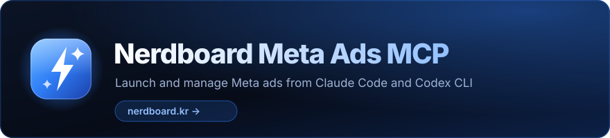
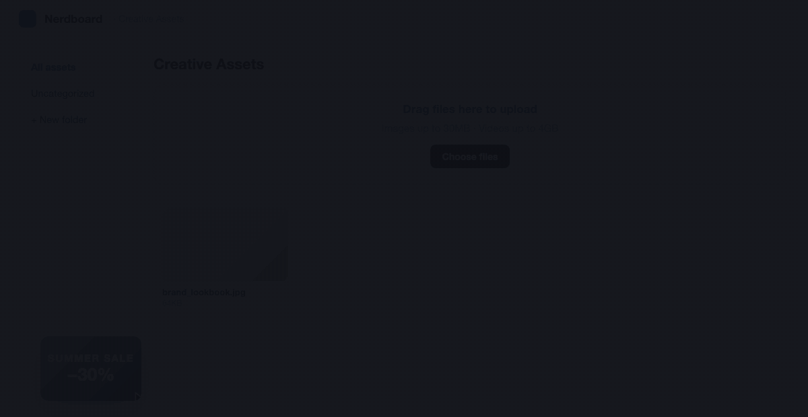
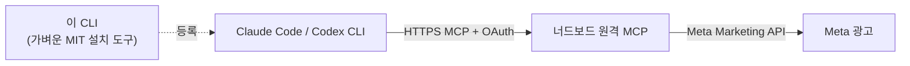

<div align="center">

**한국어** | [English](./README.en.md)

[](https://nerdboard.kr)

**Claude Code와 Codex CLI에서 말로 요청해 Meta 광고를 만들고 관리하세요.**

[](https://www.npmjs.com/package/@nerdlab-dev/meta-ads-mcp)
[](https://www.npmjs.com/package/@nerdlab-dev/meta-ads-mcp)
[](https://github.com/nerdlab-dev/meta-ads-mcp/actions/workflows/ci.yml)
[](https://nodejs.org)
[](./LICENSE)

[](https://claude.com/claude-code)
[](https://developers.openai.com/codex/cli/)
[](https://modelcontextprotocol.io)



</div>

Meta 캠페인을 설정하려면 캠페인, 광고 세트, 광고마다 광고 관리자 화면을 여러 번 거쳐야 합니다. 너드보드의 호스팅형 원격 MCP를 사용하면 AI 코딩 에이전트가 대신 처리합니다. **Meta 개발자 토큰, 자체 서버 운영, 로컬 API 키가 필요하지 않습니다.**

이 저장소에는 MIT 라이선스로 공개된 가벼운 설치 도구만 들어 있습니다. 광고 기능은 모두 너드보드 관리형 서버에서 실행됩니다.

## 할 수 있는 일

- **캠페인 만들기** - “새 소재로 일 예산 3만 원짜리 Meta 리타게팅 광고를 만들어 줘.”라고 요청하면 캠페인, 광고 세트, 광고를 한 번에 만듭니다.
- **성과 분석하기** - 광고비, ROAS, 구매, 인구 통계, 노출 위치별 성과를 대화로 확인합니다.
- **소재 관리하기** - 이미지와 동영상을 업로드하고 여러 광고에서 다시 사용합니다.
- **타겟 찾기** - 터미널을 벗어나지 않고 관심사, 행동, 지역 타겟을 검색합니다.
- **광고 제어하기** - 자연어로 광고를 일시 정지하거나 다시 시작하고 예산을 조정합니다.

## 빠른 시작

**Node.js 20 이상**과 **Claude Code** 또는 **Codex CLI**가 필요합니다. 설치에는 약 2분이 걸립니다.

처음 너드보드를 사용한다면 [너드보드 MCP 설치 가이드(PDF)](./docs/nerdboard-mcp-setup-guide.pdf)를 먼저 확인하세요. 회원가입, 광고 채널 연결, 데이터 수집, MCP 승인 과정을 화면과 함께 설명합니다.

```bash
npx -y @nerdlab-dev/meta-ads-mcp@latest install
```

두 클라이언트가 모두 설치되어 있다면 하나를 지정합니다.

```bash
npx -y @nerdlab-dev/meta-ads-mcp@latest install --client claude
npx -y @nerdlab-dev/meta-ads-mcp@latest install --client codex
```

설치 후 로그인합니다.

- **Claude Code** - `/mcp`를 실행하고 브라우저에서 로그인을 완료합니다.
- **Codex CLI** - 다음 명령을 실행합니다.

  ```bash
  codex mcp login \
    --scopes ad-channel:meta:read,ad-channel:meta:campaign:read,ad-channel:meta:creative:read,ad-channel:meta:campaign:write,ad-channel:meta:creative:write \
    nerdboard-meta-ads
  ```

로그인 과정에서 너드보드 작업공간과 허용할 권한을 선택합니다. 구독이나 연결된 Meta 광고 계정이 없다면 너드보드 화면에서 필요한 단계를 안내합니다.

이제 에이전트에게 광고 작업을 요청하면 됩니다.

## 작동 방식


```mermaid
flowchart LR
    installer["이 CLI<br/>(가벼운 MIT 설치 도구)"] -. 등록 .-> client
    client["Claude Code / Codex CLI"] -- "HTTPS MCP + OAuth" --> server["너드보드 원격 MCP"]
    server -- "Meta Marketing API" --> meta["Meta 광고"]
```

설치 도구는 각 제품의 공식 `mcp add` 명령을 사용해 MCP 클라이언트에 `nerdboard-meta-ads`를 등록합니다. 광고 작업은 모두 너드보드 관리형 서버에서 실행되며, 서버가 사용자 대신 Meta Marketing API와 통신합니다. 너드보드 계정, 활성 구독, 연결된 Meta 광고 계정이 필요합니다.

## 보안과 투명성

설치 도구가 하는 일은 다음과 같습니다.

- Codex CLI와 Claude Code가 설치되어 있는지 확인합니다.
- `nerdboard-meta-ads` 연결이 이미 있는지 확인합니다.
- 제품의 공식 `mcp add` 명령으로 연결을 등록합니다.
- 같은 연결이 이미 있으면 아무것도 변경하지 않습니다.
- 같은 이름이 다른 URL을 가리키면 덮어쓰지 않고 중단합니다.

설치 도구가 하지 않는 일은 다음과 같습니다.

- Meta 액세스 토큰을 읽거나 저장하지 않습니다.
- 로컬에서 광고 요청을 중계하거나 처리하지 않습니다.
- 너드보드 서버 코드나 광고 생성 로직을 포함하지 않습니다.
- 기존 MCP 설정을 삭제하거나 덮어쓰지 않습니다.

모든 푸시와 풀 리퀘스트에서 공개 파일 허용 목록, 인증정보 패턴, 금지 용어를 자동으로 검사합니다.

## 수동 설치

Claude Code:

```bash
claude mcp add --transport http --scope user nerdboard-meta-ads https://nerdboard.kr/mcp
```

Codex CLI:

```bash
codex mcp add nerdboard-meta-ads --url https://nerdboard.kr/mcp
```

원격 MCP를 지원하는 다른 클라이언트(Cursor 등)에는 다음 URL을 직접 등록할 수 있습니다.

```text
https://nerdboard.kr/mcp
```

## 개발

```bash
npm test
npm run check
npm run check:public
npm pack --dry-run
```

## 라이선스

이 저장소의 CLI 소스에는 [MIT 라이선스](./LICENSE)가 적용됩니다. 너드보드 서비스와 원격 MCP 서버에는 별도의 서비스 이용약관이 적용됩니다.

## 상표

OpenAI와 Codex는 OpenAI의 상표입니다. Claude와 Claude Code는 Anthropic, PBC의 상표입니다. Meta는 Meta Platforms, Inc.의 상표입니다. 각 상표는 호환성을 설명하기 위한 목적으로만 사용했습니다. 이 프로젝트는 해당 회사와 독립적으로 운영되며, 해당 회사의 제휴, 보증 또는 후원을 받지 않습니다.

---

<p align="center"><a href="https://nerdboard.kr">Nerdboard</a>가 만들었습니다.</p>
